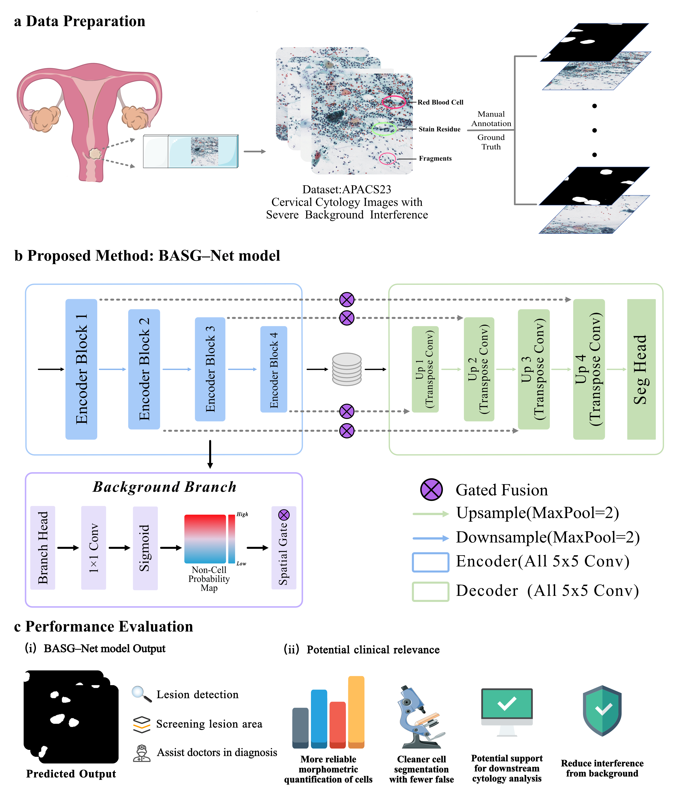

# BASG-Net: Model Architecture Only

This repository provides the **model architecture implementation** of BASG-Net, a background-aware spatial gating network for cervical cell segmentation in Pap smear images.

> **Note:** This repository releases the model architecture only. It does **not** include datasets, local paths, training scripts, evaluation scripts, logs, checkpoints, prediction masks, Grad-CAM visualizations, or experimental results.

---

## Model Overview

BASG-Net follows a U-Net-style encoder-decoder architecture for binary cervical cell segmentation. The backbone uses 5 × 5 convolutional blocks throughout the main encoder-decoder pathway.

To reduce background interference during feature fusion, the model introduces an auxiliary branch attached to the H/4 encoder feature map. This branch estimates a coarse background/non-cell probability map. The complementary response is then used as a spatial keep gate to modulate multi-level skip-connection features before decoder fusion.

The auxiliary branch should be interpreted as a background-aware feature modulation component, **not** as an independent detector for specific artifact categories such as red blood cells, mucus, staining residues, or cell debris.

---

## Architecture Overview



**Figure 1.** Overview of BASG-Net. The model contains a U-Net-style encoder-decoder backbone, an auxiliary background-aware branch attached to the H/4 encoder feature map, and spatial keep gates applied to multi-level skip connections.

---

## Model Design

The released model keeps the architecture aligned with the original implementation:

- U-Net-style encoder-decoder backbone
- 5 × 5 convolutional blocks
- auxiliary branch attached to the H/4 encoder feature map
- complementary spatial keep gate for multi-level skip connections
- segmentation head with 5 × 5 convolution plus 1 × 1 projection

---

## Repository Scope

This repository includes:

```text
basg_net/
├── __init__.py
└── model.py
```

This repository does **not** include:

```text
datasets
training scripts
evaluation scripts
trained weights
local file paths
experimental logs
prediction masks
visualization results
Grad-CAM results
```

---

## Usage

```python
import torch
from basg_net import BASGNet

model = BASGNet(in_channels=3, num_classes=1, base_c=64)

x = torch.randn(2, 3, 224, 224)
seg_logits, background_logits = model(x)

print(seg_logits.shape)        # [2, 1, 224, 224]
print(background_logits.shape) # [2, 1, 56, 56]
```

---

## Output

The model returns two tensors:

```python
seg_logits, background_logits = model(x)
```

- `seg_logits`: segmentation logits with the same spatial size as the input image
- `background_logits`: auxiliary background/non-cell logits generated from the H/4 encoder feature map

The final segmentation mask can be obtained by applying a sigmoid function and a threshold to `seg_logits`.
---

## Requirements

```text
torch
```

Install dependencies with:

```bash
pip install -r requirements.txt
```

---

## Citation

If you use this architecture or find this repository helpful, please cite the corresponding paper once available.

```bibtex
@article{basgnet,
  title   = {BASG-Net: A Background-Aware Spatial Gating Network for Cervical Cell Segmentation in Pap Smear Images},
  author  = {Author Name},
  journal = {Journal Name},
  year    = {Year}
}
```

---

## License

This repository is released for academic and research use only.
